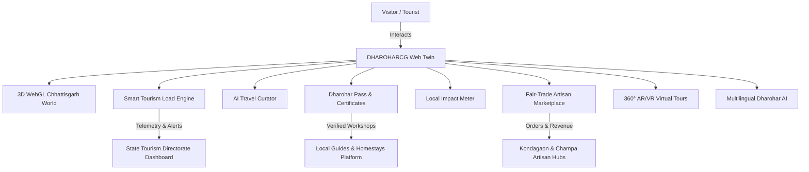

# DHAROHARCG (धरोहर छत्तीसगढ़)
### Smart Tourism & Cultural Heritage Platform for Chhattisgarh

[](https://sih.gov.in)
[]()
[]()
[]()

---

## 📌 Executive Summary

**DHAROHARCG** is a next-generation smart tourism and digital heritage preservation platform built specifically for the state of **Chhattisgarh**. Developed for the **Smart India Hackathon** under **Problem Statement ID: 26204 (Theme: Travel & Tourism)** by **Team Kshitij**.

The platform is designed as a digital twin and sustainable economic engine that bridges ancient tribal culture with cutting-edge WebGL, AI, and community-led tourism:
- **Interactive 3D Chhattisgarh World**: Procedural topographic terrain relief with real-time carrying capacity nodes, glowing corridors, and sunset lighting.
- **Smart Tourism Load & Ecological Balancer**: Live monitoring of visitor pressure (Low, Moderate, High) with automated diversion to hidden alternative gems (e.g., Tamda Ghumar, Sirpur, Madku Dweep).
- **AI Travel Curator**: Multidimensional itinerary engine generating morning/afternoon/evening schedules with instant "Optimize My Trip" controls (reduce crowds, expand nature, economize budget).
- **Digital Heritage Passport ("Dharohar Pass")**: Collects verified experiences, digital achievement records, badges, and travel streaks.
- **Local Impact Meter**: Signature economic architecture tracking the exact percentage of travel spending retained in the rural community (88%+ retention vs 22% in conventional portals).
- **Indigenous Artisan Marketplace & WebAR**: Fair-trade Dokra (lost-wax bell metal), Bastar iron craft, Kosa silk handlooms, and Kumharpara terracotta with real-time 3D WebAR preview.
- **360° AR/VR Virtual Tourism**: Immersive panoramic environments of Chitrakote Falls and ancient temples with interactive storytelling audio hotspots.
- **Multilingual Dharohar AI**: Intelligent chatbot answering tourism questions in **English**, **Hindi (हिन्दी)**, and **Chhattisgarhi (छत्तीसगढ़ी)**.
- **Unified 4-in-1 Dashboards**: Real-time portals for Tourists, Certified Guides, Artisan Sellers, and State Tourism Authorities.
- **Safety & SOS Protocol**: One-click emergency broadcasts with simulated GPS telemetry.

---

## 🏛️ System Architecture



---

## 🛠️ Technology Stack

| Layer | Technologies |
| :--- | :--- |
| **Core Framework** | React 19, TypeScript, Vite |
| **Styling & Design System** | Tailwind CSS v4, Glassmorphism, Custom HSL Earth Palettes |
| **3D & WebGL Graphics** | Three.js (Procedural terrain, shaders, orbit physics, particle fireflies) |
| **State & Persistence** | Reactive Service Layer, LocalStorage client-side persistence |
| **Icons & Micro-animations** | Lucide React, Canvas Confetti |
| **Deployment Target** | Netlify, Vercel, or Static Cloud Hosting |

---

## 📂 Project Structure

```
chattisgarh/
├── index.html                  # HTML entry with custom typography & meta
├── package.json                # Project dependencies & scripts
├── vite.config.ts              # Vite production bundler configuration
├── .env.example                # Environment variable documentation
├── src/
│   ├── main.tsx                # React root mount
│   ├── App.tsx                 # Master platform assembly
│   ├── index.css               # Core styling tokens & glassmorphism
│   ├── types/
│   │   └── index.ts            # Complete TypeScript domain models
│   ├── services/
│   │   ├── tourismLoadService.ts  # Carrying capacity & alternative engine
│   │   ├── itineraryService.ts    # AI Travel Curator generator & optimizer
│   │   ├── dharoharPassService.ts # Digital heritage passport & badges
│   │   ├── impactService.ts       # Rupee retention calculation engine
│   │   ├── marketplaceService.ts  # Craft cart & order processing
│   │   ├── chatService.ts         # Multilingual Dharohar AI engine
│   │   ├── authService.ts         # 4-in-1 Role Switcher (Admin, Tourist, Guide, Seller)
│   │   └── bookingService.ts      # Multi-modal transport, guide & stay bookings
│   ├── data/
│   │   ├── destinations.ts     # Authentic Chhattisgarh destinations & load data
│   │   ├── experiences.ts      # Community-verified cultural workshops
│   │   ├── products.ts         # Dokra, Kosa silk & terracotta marketplace items
│   │   ├── festivals.ts        # Bastar Dussehra, Madai, Sirpur Festival
│   │   ├── foods.ts            # Chila, Fara, Bafauri, Dubki Kadi, Angakar
│   │   ├── homestays.ts        # Rural community eco-cottages
│   │   ├── districts.ts        # Geographical and cultural zones
│   │   ├── challenges.ts       # #DiscoverDharoharCG quest challenges
│   │   ├── vrScenes.ts         # 360° panoramic virtual tour hotspots
│   │   └── emergency.ts        # Helplines (112, 108, Forest ranger outposts)
│   └── components/
│       ├── hero/
│       │   ├── HeroSection.tsx         # Headline, live counters & CTA
│       │   └── Chhattisgarh3DWorld.tsx # Three.js interactive 3D relief
│       ├── discovery/
│       │   ├── DestinationExplorer.tsx # Filtered catalog with load badges
│       │   └── DestinationDetailModal.tsx # Complete heritage dossier
│       ├── tourism/
│       │   └── SmartTourismLoad.tsx    # Diurnal crowd curves & alternative routing
│       ├── planning/
│       │   └── AITripPlanner.tsx       # AI bespoke trip generator
│       ├── passport/
│       │   └── DharoharPassSection.tsx # Digital passport, badges & certificates
│       ├── experiences/
│       │   └── ExperiencesSection.tsx  # Verified community activities
│       ├── impact/
│       │   └── LocalImpactMeter.tsx    # Rupee retention simulator
│       ├── marketplace/
│       │   ├── MarketplaceSection.tsx  # Artisan catalog & bag checkout
│       │   └── ARProductModal.tsx      # WebAR 3D inspector & material shaders
│       ├── vr/
│       │   └── VRTourismSection.tsx    # 360° virtual tour & soundscapes
│       ├── travel/
│       │   └── TravelBookingSection.tsx # Green cabs, buses, homestays, guides
│       ├── community/
│       │   ├── CommunityChallenges.tsx # Eco-quests & responsible score
│       │   └── GlobalSearchModal.tsx   # Fast modal search (Ctrl+K)
│       ├── dashboards/
│       │   └── DashboardsSection.tsx   # 4-in-1 Role Switcher console
│       ├── safety/
│       │   └── SOSModal.tsx            # Emergency contacts & GPS broadcast
│       ├── chat/
│       │   └── DharoharAIChat.tsx      # Floating multilingual chatbot
│       └── layout/
│           ├── Navbar.tsx              # Brand header & quick navigation
│           └── Footer.tsx              # SIH context & footer links
```

---

## ⚡ Installation & Local Execution

### Prerequisites
- Node.js (v18 or higher recommended)
- npm or yarn

### 1. Clone or Open Workspace
```bash
git clone https://github.com/Rahul-sahu-001/chatticg.git
cd chattisgarh
```

### 2. Install Dependencies
```bash
npm install
```

### 3. Run Development Server
```bash
npm run dev
```
Open [http://localhost:5173](http://localhost:5173) in your browser.

### 4. Build for Production
```bash
npm run build
```
Creates an optimized production bundle inside the `dist/` directory.

---

## 💡 Demo Mode & Offline Resilience

To ensure flawless evaluation during hackathon presentations without relying on live external API keys:
1. **Fallback Architecture**: All AI curations, tourism pressure charts, and 3D terrain models operate seamlessly in client-side **Demo Mode**.
2. **Mock Blockchain & Certificates**: Digital achievement records are generated with cryptographic hashes for prototype inspection with zero external network dependencies.
3. **Role Switcher**: Click the role selector in the **Dashboards** section to toggle between **State Admin**, **Tourist**, **Local Guide**, and **Artisan Seller** instantaneously.

---

## 🏆 Smart India Hackathon Details

- **Problem Statement ID**: 26204
- **Theme**: Travel & Tourism
- **Category**: Software
- **Team**: Team Kshitij
- **Platform**: DHAROHARCG (धरोहर छत्तीसगढ़)

---

## 📄 License
Released under the MIT License for educational and Smart India Hackathon demonstration purposes.
